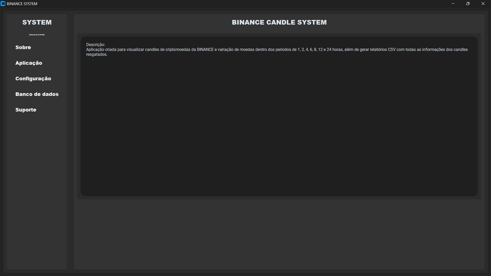
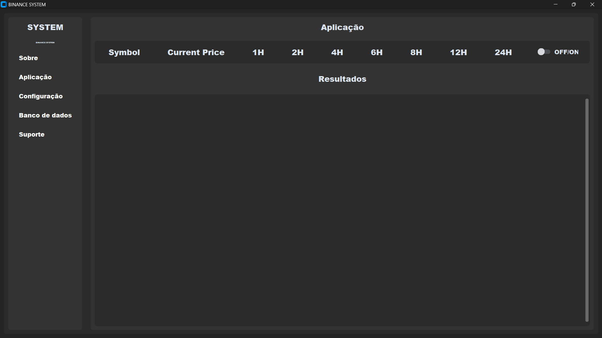
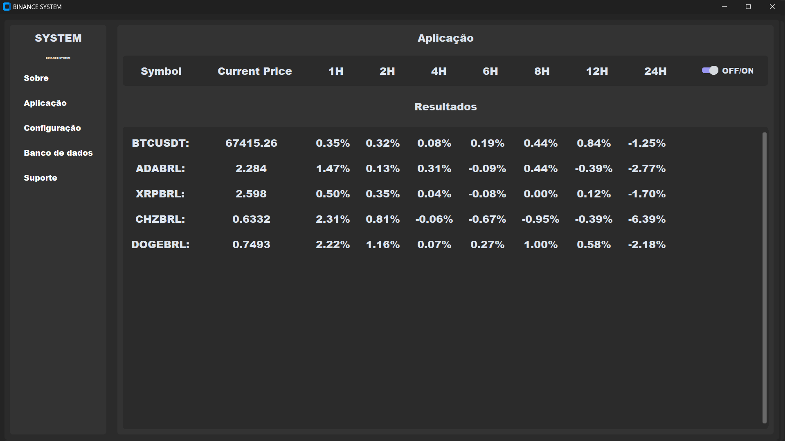
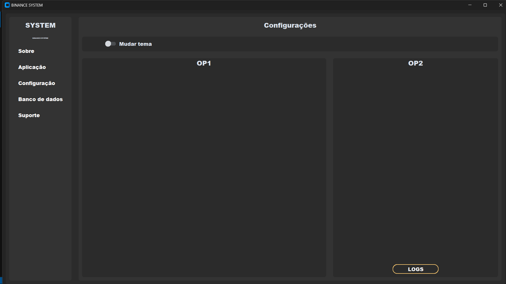
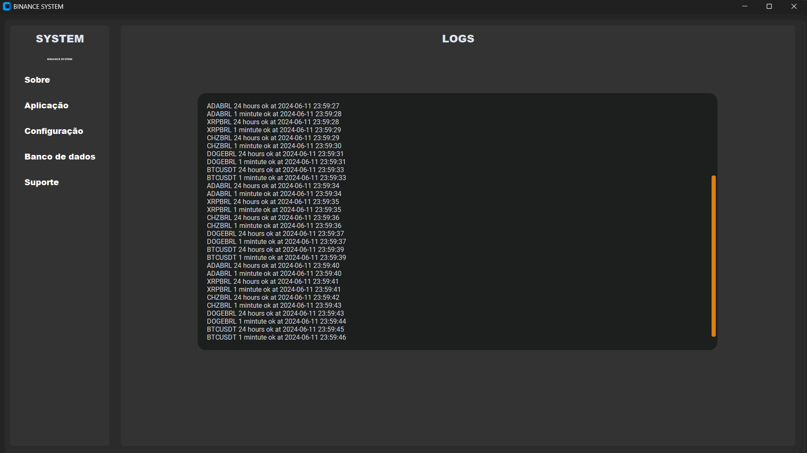
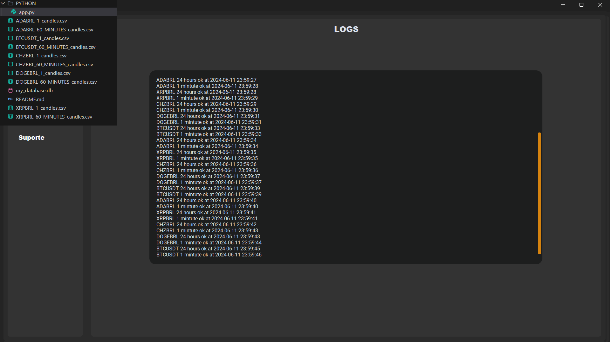
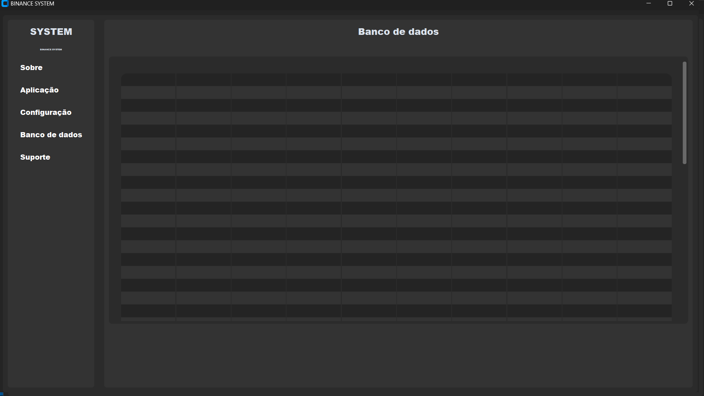
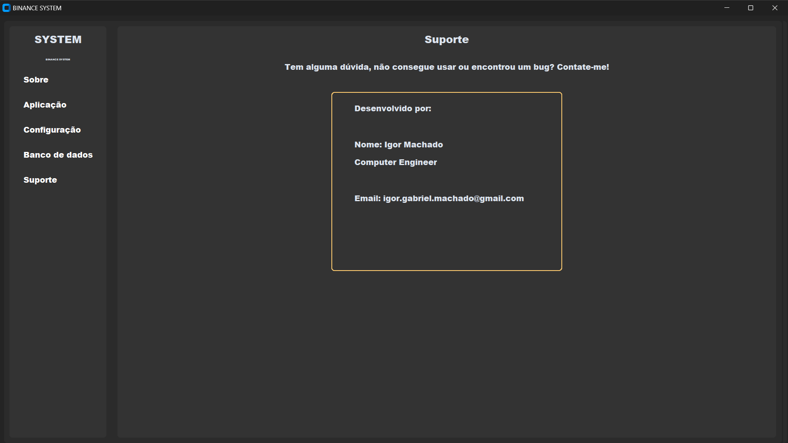

# Application to visualize candles and cryptocurrency variations in real time
Application created to visualize BINANCE cryptocurrency candles and currency variations within periods of 1, 2, 4, 6, 8, 12 and 24 hours, in addition to generating CSV reports with all the information on the redeemed candles. 
With a dynamic and easy-to-use interface.

The application creates a db for login but its disabled by default, if you want to use it, you must enable it removing the comment on the line 489 and the line 599 and the line 488.

Inside this folder have a folder JS with a html file "newTestJS.html", this file opens a webpage with the application. A version is JS.

## HOW RUN?
1º - download the paste.
2º - install python (latest version).
3º - install pylance and python debbuger.
4° - install (pip) the libraries on the top of the file.
5º - run application.
6º - go to application page and set the button on.
7º - good use!

## SCREENSHOTS
About page.

Application page.

Configure page.

Database page.

Support page.

